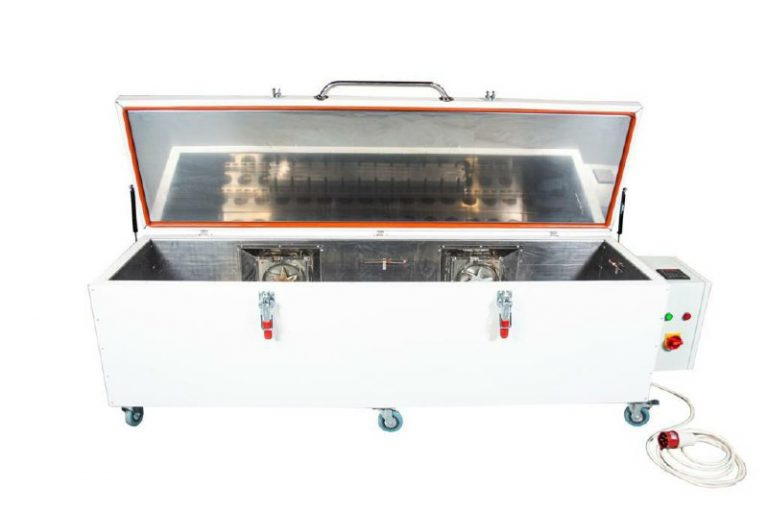
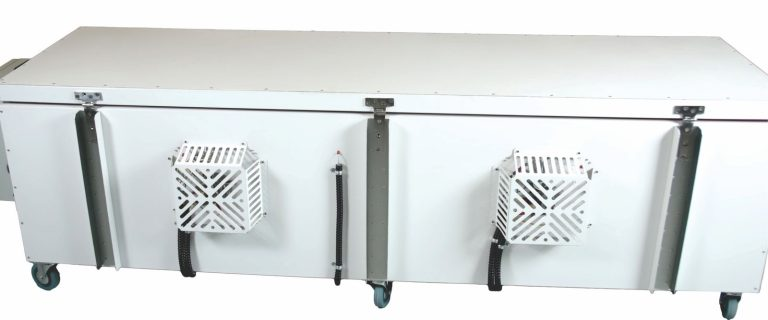
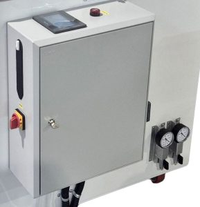

import img1 from './assets/2a289d6c-cac1-4c9c-8b69-bba0350b7694-1-768x512.jpg'
import img2 from './assets/oven-700-2000-mainview-768x716.jpg'

import img7 from './assets/OVEN-500-1000ext.png'
import img8 from './assets/OVEN-500-1000int.png'

import img3 from './assets/OVEN-500-2000ext.png'
import img4 from './assets/OVEN-500-2000int.png'

import img5 from './assets/OVEN-500-1500ext.png'
import img6 from './assets/OVEN-500-1500int.png'

import img9 from './assets/OVEN-500-4000ext.png'
import img10 from './assets/OVEN-500-4000int.png'

import img11 from './assets/OVEN-700-1000ext.png'
import img12 from './assets/OVEN-700-1000int.png'

import img13 from './assets/OVEN-700-1500ext.png'
import img14 from './assets/OVEN-700-1500int.png'

import img15 from './assets/OVEN-700-2000ext.png'
import img16 from './assets/OVEN-700-2000int.png'

import img17 from './assets/OVEN-700-4000ext.png'
import img18 from './assets/OVEN-700-4000int.png'

## Precision Composite Curing Ovens for Industrial and R&D Applications

High-performance composite curing ovens by UAVOS Inc. for curing, post-curing, and heat processing of composites, prepregs, thermoplastics, and tooling. Precision PID control, vacuum ports, and energy-efficient design for industrial and R&D applications

### PRODUCT OVERVIEW

High-Performance Composite Heat Processing Solutions
UAVOS Inc. manufactures high-performance composite curing ovens engineered to the highest industrial standards. Designed for continuous operation at 200°C, these professional ovens deliver unmatched accuracy, efficiency, and durability for the most demanding composite material processing applications.

<iframe
  width="100%"
  height="400px"
  src="https://www.youtube.com/embed/jOTGJBNunlc"
  title="YouTube video player"
  frameBorder="0"
  allow="accelerometer; autoplay; clipboard-write; encrypted-media; gyroscope; picture-in-picture"
  allowFullScreen
/>

As standard, our Composite Curing Oven range features:

- Heavy-duty stainless steel interior for maximum durability;
- Increased temperature accuracy with rapid response;
- High thermal efficiency using thermally isolated steel panels with a ceramic fiber-insulated core;
- Touchscreen control system with intuitive programming for industrial oven operations.

Our ovens are specifically designed for composite manufacturing, including curing and post-

### TOP-LOADING OVENS MODEL SPECIFICATIONS

| **Model** | **Internal Volume, L** | **Fan Heating Element Power, kW** | **Maximum Power Consumption, W** | **Total Weight, kg** | **Internal Dimension (D×H×W), mm** | **Outside Dimension (D×H×W), mm** | **Installation Space (W×H×D), mm** | **Price, USD, EXW** |
|:--|:--:|:--:|:--:|:--:|:--:|:--:|:--:|--:|
| [OVEN-500-1000](#) | 250 | 2 | 2400 | 130 | 500×500×1000 | 778×810×1325 | 2300×3000×2300 | **10 100** |
| [OVEN-500-1500](#) | 375 | 4 | 4400 | 165 | 500×500×1500 | 778×810×1825 | 2800×3000×2300 | **11 100** |
| [OVEN-500-2000](#) | 500 | 4 | 4400 | 210 | 500×500×2000 | 778×810×2325 | 3300×3000×2300 | **12 100** |
| [OVEN-500-4000](#) | 1000 | 8 | 8800 | 390 | 500×500×4000 | 978×810×4325 | 5300×3000×2300 | **20 200** |
| [OVEN-700-1000](#) | 490 | 2 | 2200 | 180 | 700×700×1000 | 978×1010×1325 | 2300×3000×2300 | **11 100** |
| [OVEN-700-1500](#) | 735 | 4 | 4400 | 220 | 700×700×1500 | 978×1010×1825 | 2800×3000×2300 | **12 100** |
| [OVEN-700-2000](#) | 980 | 4 | 4400 | 275 | 700×700×2000 | 978×1010×2325 | 3300×3000×2300 | **13 100** |
| [OVEN-700-4000](#) | 1960 | 8 | 8800 | 520 | 700×700×4000 | 978×1010×4325 | 5300×3000×2300 | **21 200** |

<ProductShowcase
  data={{
    "OVEN-500-1000": {
      table: `
      <table>
        <tr><td>Model</td><td>OVEN-500-1000</td></tr>
        <tr><td>Internal volume, L</td><td>250</td></tr>
        <tr><td>Fan heating element, power, kW</td><td>2</td></tr>
        <tr><td>Maximum power consumption, W</td><td>2400</td></tr>
        <tr><td>Total weight, kg</td><td>130</td></tr>
        <tr><td>Internal dimension (D×H×W), mm</td><td>500×500×1000</td></tr>
        <tr><td>Outside dimension (D×H×W), mm</td><td>778×810×1325</td></tr>
        <tr><td>Installation space (W×H×D), mm</td><td>2300×3000×2300</td></tr>
      </table>`,
      price: "10 100",
      downloads: [
        { name: "Download Drawing (PDF)", path: "/products/OVEN-500-1000.pdf" },
        { name: "Download OVEN-XXX-XXX Manual (PDF)", path: "/products/Manual-OVEN-ххх-хххх.pdf" },
{ name: "Conformity Certificate (PDF)", path: "/products/Oven-CONFORMITY-CERTIFICATE.pdf" },
{ name: "Validation of Matrix Heating Uniformity (PDF)", path: "/products/Validation-of-Matrix-Heating-Uniformity-in-UAVOS-Composite-Curing-Oven.pdf" }
      ],
      images: [
        ,
        ,
        ,
        ,
      ],
    },
    "OVEN-500-1500": {
      table: `
      <table>
        <tr><td>Model</td><td>OVEN-500-1500</td></tr>
        <tr><td>Internal volume, L</td><td>375</td></tr>
        <tr><td>Fan heating element, power, kW</td><td>4</td></tr>
        <tr><td>Maximum power consumption, W</td><td>4400</td></tr>
        <tr><td>Total weight, kg</td><td>165</td></tr>
        <tr><td>Internal dimension (D×H×W), mm</td><td>500×500×1500</td></tr>
        <tr><td>Outside dimension (D×H×W), mm</td><td>778×810×1825</td></tr>
        <tr><td>Installation space (W×H×D), mm</td><td>2800×3000×2300</td></tr>
      </table>`,
      price: "11 100",
      downloads: [
        { name: "Download Drawing (PDF)", path: "/products/OVEN-500-1500.pdf" },
        { name: "Download OVEN-XXX-XXX Manual (PDF)", path: "/products/Manual-OVEN-ххх-хххх.pdf" },
{ name: "Conformity Certificate (PDF)", path: "/products/Oven-CONFORMITY-CERTIFICATE.pdf" },
{ name: "Validation of Matrix Heating Uniformity (PDF)", path: "/products/Validation-of-Matrix-Heating-Uniformity-in-UAVOS-Composite-Curing-Oven.pdf" }
      ],
      images: [
        ,
        ,
        ,
        ,
      ],
    },
    "OVEN-500-2000": {
      table: `
      <table>
        <tr><td>Model</td><td>OVEN-500-2000</td></tr>
        <tr><td>Internal volume, L</td><td>500</td></tr>
        <tr><td>Fan heating element, power, kW</td><td>4</td></tr>
        <tr><td>Maximum power consumption, W</td><td>4400</td></tr>
        <tr><td>Total weight, kg</td><td>210</td></tr>
        <tr><td>Internal dimension (D×H×W), mm</td><td>500×500×2000</td></tr>
        <tr><td>Outside dimension (D×H×W), mm</td><td>778×810×2325</td></tr>
        <tr><td>Installation space (W×H×D), mm</td><td>3300×3000×2300</td></tr>
      </table>`,
      price: "12 100",
      downloads: [
        { name: "Download Drawing (PDF)", path: "/products/OVEN-500-2000.pdf" },
        { name: "Download OVEN-XXX-XXX Manual (PDF)", path: "/products/Manual-OVEN-ххх-хххх.pdf" },
{ name: "Conformity Certificate (PDF)", path: "/products/Oven-CONFORMITY-CERTIFICATE.pdf" },
{ name: "Validation of Matrix Heating Uniformity (PDF)", path: "/products/Validation-of-Matrix-Heating-Uniformity-in-UAVOS-Composite-Curing-Oven.pdf" }
      ],
      images: [
        ,
        ,
        ,
        ,
      ],
    },
    "OVEN-500-4000": {
      table: `
      <table>
        <tr><td>Model</td><td>OVEN-500-4000</td></tr>
        <tr><td>Internal volume, L</td><td>1000</td></tr>
        <tr><td>Fan heating element, power, kW</td><td>8</td></tr>
        <tr><td>Maximum power consumption, W</td><td>8800</td></tr>
        <tr><td>Total weight, kg</td><td>390</td></tr>
        <tr><td>Internal dimension (D×H×W), mm</td><td>500×500×4000</td></tr>
        <tr><td>Outside dimension (D×H×W), mm</td><td>778×810×4325</td></tr>
        <tr><td>Installation space (W×H×D), mm</td><td>5300×3000×2300</td></tr>
      </table>`,
      price: "20 200",
      downloads: [
        { name: "Download Drawing (PDF)", path: "/products/OVEN-500-4000.pdf" },
        { name: "Download OVEN-XXX-XXX Manual (PDF)", path: "/products/Manual-OVEN-ххх-хххх.pdf" },
{ name: "Conformity Certificate (PDF)", path: "/products/Oven-CONFORMITY-CERTIFICATE.pdf" },
{ name: "Validation of Matrix Heating Uniformity (PDF)", path: "/products/Validation-of-Matrix-Heating-Uniformity-in-UAVOS-Composite-Curing-Oven.pdf" }
      ],
      images: [
        ,
        ,
        ,
        ,
      ],
    },
    "OVEN-700-1000": {
      table: `
      <table>
        <tr><td>Model</td><td>OVEN-700-1000</td></tr>
        <tr><td>Internal volume, L</td><td>490</td></tr>
        <tr><td>Fan heating element, power, kW</td><td>2</td></tr>
        <tr><td>Maximum power consumption, W</td><td>2200</td></tr>
        <tr><td>Total weight, kg</td><td>180</td></tr>
        <tr><td>Internal dimension (D×H×W), mm</td><td>700×700×1000</td></tr>
        <tr><td>Outside dimension (D×H×W), mm</td><td>978×1010×1325</td></tr>
        <tr><td>Installation space (W×H×D), mm</td><td>2300×3000×2300</td></tr>
      </table>`,
      price: "11 000",
      downloads: [
        { name: "Download Drawing (PDF)", path: "/products/OVEN-700-1000.pdf" },
        { name: "Download OVEN-XXX-XXX Manual (PDF)", path: "/products/Manual-OVEN-ххх-хххх.pdf" },
{ name: "Conformity Certificate (PDF)", path: "/products/Oven-CONFORMITY-CERTIFICATE.pdf" },
{ name: "Validation of Matrix Heating Uniformity (PDF)", path: "/products/Validation-of-Matrix-Heating-Uniformity-in-UAVOS-Composite-Curing-Oven.pdf" }
      ],
      images: [
        ,
        ,
        ,
        ,
      ],
    },
    "OVEN-700-1500": {
      table: `
      <table>
        <tr><td>Model</td><td>OVEN-700-1500</td></tr>
        <tr><td>Internal volume, L</td><td>735</td></tr>
        <tr><td>Fan heating element, power, kW</td><td>4</td></tr>
        <tr><td>Maximum power consumption, W</td><td>4400</td></tr>
        <tr><td>Total weight, kg</td><td>220</td></tr>
        <tr><td>Internal dimension (D×H×W), mm</td><td>700×700×1500</td></tr>
        <tr><td>Outside dimension (D×H×W), mm</td><td>978×1010×1825</td></tr>
        <tr><td>Installation space (W×H×D), mm</td><td>2800×3000×2300</td></tr>
      </table>`,
      price: "12 100",
      downloads: [
        { name: "Download Drawing (PDF)", path: "/products/OVEN-700-1500.pdf" },
        { name: "Download OVEN-XXX-XXX Manual (PDF)", path: "/products/Manual-OVEN-ххх-хххх.pdf" },
{ name: "Conformity Certificate (PDF)", path: "/products/Oven-CONFORMITY-CERTIFICATE.pdf" },
{ name: "Validation of Matrix Heating Uniformity (PDF)", path: "/products/Validation-of-Matrix-Heating-Uniformity-in-UAVOS-Composite-Curing-Oven.pdf" }
      ],
      images: [
        ,
        ,
        ,
        ,
      ],
    },
    "OVEN-700-2000": {
      table: `
      <table>
        <tr><td>Model</td><td>OVEN-700-2000</td></tr>
        <tr><td>Internal volume, L</td><td>980</td></tr>
        <tr><td>Fan heating element, power, kW</td><td>4</td></tr>
        <tr><td>Maximum power consumption, W</td><td>4400</td></tr>
        <tr><td>Total weight, kg</td><td>275</td></tr>
        <tr><td>Internal dimension (D×H×W), mm</td><td>700×700×2000</td></tr>
        <tr><td>Outside dimension (D×H×W), mm</td><td>978×1010×2325</td></tr>
        <tr><td>Installation space (W×H×D), mm</td><td>3300×3000×2300</td></tr>
      </table>`,
      price: "13 100",
      downloads: [
        { name: "Download Drawing (PDF)", path: "/products/OVEN-700-2000.pdf" },
        { name: "Download OVEN-XXX-XXX Manual (PDF)", path: "/products/Manual-OVEN-ххх-хххх.pdf" },
{ name: "Conformity Certificate (PDF)", path: "/products/Oven-CONFORMITY-CERTIFICATE.pdf" },
{ name: "Validation of Matrix Heating Uniformity (PDF)", path: "/products/Validation-of-Matrix-Heating-Uniformity-in-UAVOS-Composite-Curing-Oven.pdf" }
      ],
      images: [
        ,
        ,
        ,
        ,
      ],
    },
    "OVEN-700-4000": {
      table: `
      <table>
        <tr><td>Model</td><td>OVEN-700-4000</td></tr>
        <tr><td>Internal volume, L</td><td>1960</td></tr>
        <tr><td>Fan heating element, power, kW</td><td>8</td></tr>
        <tr><td>Maximum power consumption, W</td><td>8800</td></tr>
        <tr><td>Total weight, kg</td><td>520</td></tr>
        <tr><td>Internal dimension (D×H×W), mm</td><td>700×700×4000</td></tr>
        <tr><td>Outside dimension (D×H×W), mm</td><td>978×1010×4325</td></tr>
        <tr><td>Installation space (W×H×D), mm</td><td>5300×3000×2300</td></tr>
      </table>`,
      price: "21 200",
      downloads: [
        { name: "Download Drawing (PDF)", path: "/products/OVEN-700-4000.pdf" },
        { name: "Download OVEN-XXX-XXX Manual (PDF)", path: "/products/Manual-OVEN-ххх-хххх.pdf" },
{ name: "Conformity Certificate (PDF)", path: "/products/Oven-CONFORMITY-CERTIFICATE.pdf" },
{ name: "Validation of Matrix Heating Uniformity (PDF)", path: "/products/Validation-of-Matrix-Heating-Uniformity-in-UAVOS-Composite-Curing-Oven.pdf" }
      ],
      images: [
        ,
        ,
        ,
        ,
      ],
    },
  }}
/>

### INDUSTRIAL CURING OVEN FEATURES & SPECIFICATIONS

- Precision PID temperature control.
- Integrated overheat protection system.
- Programmable ramp and soak cycles.
- Standard mode and 19 pre-programmed settings.
- Two independent vacuum ports for vacuum-assisted curing.
- Rugged, production-ready build.
- Touchscreen controller with live temperature graphing.
- High energy efficiency for reduced operational costs.

**Certified Quality**

Our composite curing ovens are CE marked, ensuring compliance with the essential health, safety, and environmental requirements of the European Union. This CE marking demonstrates that our equipment meets the international standards for reliability and safety. 

> *"Unrivalled value for money along with exceptional features and performance."*

Engineered and manufactured in-house by UAVOS Inc., these ovens deliver reliable, repeatable, and precise curing for composite manufacturing, research, and development.

**Advanced PID Temperature Control and Programming**

Our curing ovens offer precise PID temperature control, featuring calibrated thermocouples and fan-assisted airflow to minimize stratification.

All curing parameters — including temperature, ramp rate, and soak time— are fully programmable, allowing users to store and run optimized cycles for different materials with ultimate precision and consistency. 

**Applications: Prepreg, Thermoplastics, and Tooling**
*Recommended for Aerospace, Automotive, and Marine Composites*

- Curing of prepreg composite parts.
- Post-curing of high-temperature tooling and molds.
- Processing thermoplastics such as PP and PLA.
- Silicone curing and resin casting.
- R&D and materials testing for composite development.

**Touchscreen Controller with 19 Custom Programs**

- Developed by UAVOS Inc.
- 19 customizable programs + standard mode.
- Onscreen temperature graph overlays for real-time monitoring.
- Intuitive program creation for complex ramp and dwell cycles.

---

<FlexContainer className="nowrap">

<FlexContainer className="column">

**Vacuum-Assisted Curing for Precision Results**

- Two integral ports with optional gauge and valve assemblies.
- Supports one or two independent vacuum lines.

</FlexContainer>

</FlexContainer>

### SHIPPING&DATASHEETS

<FlexContainer className="nowrap">

<FlexContainer className="column">

**Worldwide Shipping & Quality Assurance by UAVOS Inc.**

- Designed for worldwide shipping.
- Securely mounted to pallets for transport.
- Forklift or a tail-lift may be required for unloading.

**Safety Guidelines and Technical Datasheets**

UAVOS Inc. is not responsible for product misuse or failure to follow safety guidelines. Always consult the provided technical and safety data sheets before use. 

</FlexContainer>

</FlexContainer>