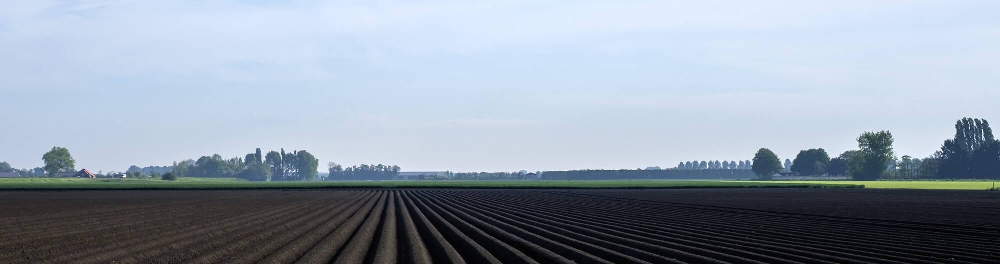
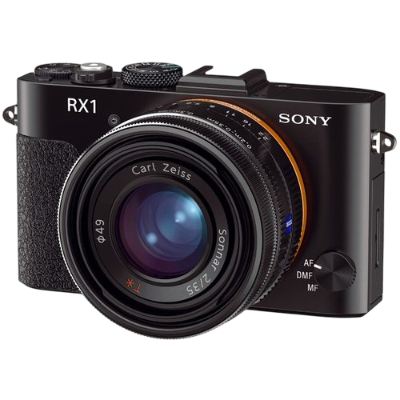

import borey from '../products/assets/Borey20-square-300x300.jpg'

## AGRICULTURAL SERVICES

Our platform & service packages offer actionable data in real time to assist the client in making informed decisions that increase yields. Infrared sensors and NDVI cameras are flown to collect imagery which is used for best crop management. Our data insights include:

- Field health maps
- Soil moisture content
- Growth progress
- Insect damage
- Weed control
- Targeted fertilization
- Accurate identification of crop yields
- Insurance claim validation.

UAVOS’ platform & services packages help with short and long term forecasting that ultimately contribute to increased profits. Access to real time field conditions is a powerful management tool that produces actionable results.

## Our Systems

<Cards num="2">
    <Card 
    title="BOREY 20" 
    href="/products/cfwuav/_3_fw" 
    image={borey}
    >
    </Card>
</Cards>

<Cards num="4">
    <Card 
    title="Digital Camera" 
    >
        <ModalLink type="mdx" title="Digital Camera" label="> Open Digital Camera">
            
            ### Body
            | Param | Value |
            |---|---|
            | Body type | Large sensor compact |
            ### Sensor
            | Param | Value |
            |---|---|
            | Max resolution | 8000 × 6000 |
            | Other resolutions | 6000 × 3376, 3936 × 2624, 3936 × 2216, 2640 × 1760, 2640 × 1488 |
            | Image ratio w:h | 3:2, 16:9 |
            | Effective pixels | 42 megapixels |
            | Sensor photo detectors | 25 megapixels |
            | Sensor size | Full frame (35.8 × 23.8 mm) |
            | Sensor type | CMOS |
            ### Image
            | Param | Value |
            |---|---|
            | ISO | Auto, 100, 200, 400, 800, 1600, 3200, 6400, 12800, 25600 |
            | White balance presets | 9 |
            | Custom white balance | Yes (1) |
            | Image stabilization | No |
            | Uncompressed format | RAW |
            ### Optics & Focus
            | Param | Value |
            |---|---|
            | Focal length (equiv.) | 35 mm |
            | Optical zoom | 1× |
            | Maximum aperture | F2–22 |
            | Autofocus | Contrast Detect (sensor), Multi-area, Center, Selective single-point, Tracking, Single, Face Detection |
            | Digital zoom | Yes (14×) |
            | Manual focus | Yes |
            | Normal focus range | 25 cm (9.84″) |
            | Number of focus points | 25 |
            ### Screen / Viewfinder
            | Param | Value |
            |---|---|
            | Articulated LCD | Fixed |
            | Screen size | 3″ |
            | Screen dots | 1,229,000 |
            | Touch screen | No |
            | Screen type | Xtra Fine TFT LCD |
            | Live view | Yes |
            | Viewfinder type | None |
            ### Photography features
            | Param | Value |
            |---|---|
            | Minimum shutter speed | 30 sec |
            | Maximum shutter speed | 1/4000 sec |
            | Aperture priority | Yes |
            | Shutter priority | Yes |
            | Manual exposure mode | Yes |
            | Subject / scene modes | Yes |
            | Built-in flash | Yes (Pop-up) |
            | Flash range | 6.00 m |
            | External flash | Yes (via hot-shoe) |
            | Flash modes | Auto, On, Off, Slow Sync |
            | Continuous drive | 5.0 fps |
            | Self-timer | Yes (2 or 10 sec) |
            | Metering modes | Multi, Center-weighted, Spot |
            | Exposure compensation | ±3 (at 1/3 EV steps) |
            | AE Bracketing | (3 frames at 1/3 EV, 2/3 EV steps) |
            | WB Bracketing | No |
            ### Videography features
            | Param | Value |
            |---|---|
            | Resolutions | 1920 × 1080 (60, 50, 25, 24 fps), 1440 × 1080 (30, 25 fps), 1280 × 720 (30 fps), 640 × 480 (30, 25 fps) |
            | Format | MPEG-4, AVCHD |
            | Videography notes | AVCHD: 28M PS (1920×1080, 60p/50p), 24M FX (1920×1080, 60i/50i), 17M FH (1920×1080, 60i/50i), 24M FX (1920×1080, 24p/25p), 17M FH (1920×1080, 24p/25p) |
            | Microphone | Stereo |
            | Speaker | Mono |
            ### Storage
            | Param | Value |
            |---|---|
            | Storage types | SD/SDHC/SDXC, Memory Stick Duo/Pro Duo/Pro-HG Duo |
            ### Connectivity
            | Param | Value |
            |---|---|
            | USB | USB 2.0 (480 Mbit/sec) |
            | HDMI | Yes (Mini) |
            | Wireless | Eye-Fi Connected |
            | Remote control | No |
            ### Physical
            | Param | Value |
            |---|---|
            | Environmentally sealed | No |
            | Battery | Battery Pack |
            | Battery description | Lithium-Ion NP-BX1 battery |
            | Battery Life (CIPA) | 270 |
            | Weight (inc. batteries) | 482 g (1.06 lb / 17.00 oz) |
            | Dimensions | 113 × 65 × 70 mm (4.45 × 2.56 × 2.76″) |
            ### Other features
            | Param | Value |
            |---|---|
            | Orientation sensor | Yes |
            | Timelapse recording | No |
            | GPS | None |

        </ModalLink>
    </Card>
    <Card 
    title="Multispectral Camera" 
    >

    <ModalLink type="mdx" title="Multispectral Camera" label="> Open Multispectral Camera">
        
        ### Multispectral Camera

        | Parameter | Value |
        |---|---|
        | Weight | 135 grams (4.8 oz.) *(including Sunshine Sensor and cable)* |
        | Dimensions | 5.9 cm × 4.1 cm × 3.0 cm (2.3 in × 1.6 in × 1.2 in) |
        | External Power | 5.0 V DC, 8 W nominal (12 W peak) |
        | Spectral Bands | Green, red, red edge, near IR *(global shutter, narrowband)* |
        | RGB Color Output | 16 MP *(rolling shutter)* |
        | Ground Sample Distance (GSD) | 13 cm per pixel (per band) at 120 m (~400 ft) AGL |
        | Capture Rate | 1 capture per second (all bands), 10-bit RAW |
        | Interfaces | USB (PTP) |
        | Field of View | 70.6° HFOV |
        
        

    </ModalLink>

    </Card>
</Cards>

