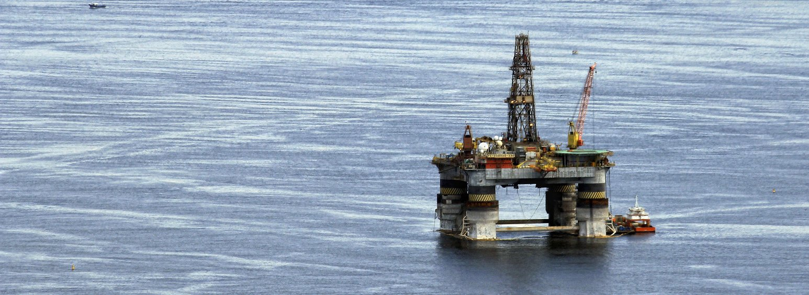

## INDUSTRIAL INSPECTIONS OIL & GAS INDUSTRY

UAVOS offers end-to-end UAV service packages for inspection of remote oil and gas assets. From right-of-way surveying, to aerial leak detection, to post-event and emergency response, our inspection flights gather time-sensitive data that informs critical decision making and contributes to safer outcomes.

-   **Gas Pipeline Right-of-Way Inspection**

    UAVOS’ aircraft are deployed to inspect gas pipeline right-of-ways and assess areas for problematic conditions such as encroachment, ground disturbance, soil erosion, vegetation overgrowth, discoloration, exposed pipe, and missing pipeline markers.

-   **Gas Burn-off Stack Tip Inspection**

    Due to the size of the flare stacks and their central role in the oil industry, coking plants and landfill sites must undergo strict and thorough inspections. Human lead inspections pose a risk of injury and extends labor costs. The UAVOS platform & service package can not only improve workplace safety but also speed up the inspection process while lowering costs.

-   The UAVOS platform & service package enables rapid detection of possible defects while monitoring flare function. This provides protection to the surrounding area from uncontrolled gas migration (explosion, poisoning, odor). Early detection offers the client lead time to replace harmful gases with less noxious gases before the problem has evolved thus avoiding risk reduction cost overruns.

- **Offshore Oil Platform Construction Inspections**

    UAVOS’ platform and service packages are the ideal method for accessing difficult to reach locations at remote sites. UAVOS drones reduce labor in the field while increasing the overall safety by enabling the operator to view the subject from a great distance.

- **Emergency Response**

    UAVOS drones are the most cost effective method to assess disaster damage quickly. Our collection of readily available spectral payloads is perfect for fast assessments and enable clients to make efficient disaster response plans. Furthermore, our quick repeats offer persistent monitoring for evolving situations i.e., gas leaks, erosion effects. Our comparative data can be blended with client outage management system (OMS) to improve decision making and reduce service restoration times.

-   **Bridge Inspections**

    UAVOS platform and service packages offer the best method for safe, remote and repeatable inspections of bridges. Our Ultra HD 4K live feed optical payload identifies erosion effects, cracks and corrosion. Infrasonic detection is also available for acoustic flaw detection.
    
-   **On & Offshore Wind Turbine Inspections**

    Our airborne inspection service package offers live-feed, record keeping for turbine and blade health and saves time in the field, lowering labor costs.
    
-   **Other Industrial Applications Include:**

    - Wellhead inspections for gas leaks and general pipeline health
    - Live power line and transmission system inspections with 3D mapping
    - Mapping & surveys with geo-referenced 3D imaging
    - Inspection/validation of distribution system lines for property surveying
    - Railroad line inspectionsx

**POWER LINE INSPECTION**

UAV Power line inspection services can be a vital time and money saving component of any utility company's inspection processes. The Power and Utility industry can now reap the benefits of 3D mapping from using a professional Unmanned Aerial Vehicle to conduct live power line inspections. With UAV technology you can now inspect your assets live, allowing you to focus more attention on repairing identified problems rather than using up valuable circuit outage time for fault finding.

- Mapping and Surveys
    
    UAVOS delivers cost effective mapping and site surveys to electric utility engineering and construction teams to help plan for infrastructure expansions, provide construction progress documentation and more. Geo-referenced images obtained from our UAVs can be imported as 3d models directly into CAD and engineering programs.
- Electric T&D Vegetation Management
    
    UAVOS conducts autonomous flights powerlines that enables cost effective identification of vegetation clearances, undergrowth assessment, audit of tree trim contractors, predictive modelling and more thorough HD imagery, LiDAR data and other sensors.
- Distribution System Inspection
    
    Remote inspection of distribution lines in hard-to-access areas such as rear-property pole lines enable our team to identify concerns while negating the need to have utility workers access private property or navigate challenging terrain.
- Transmission System Inspection
    
    UAVOS works with electric utilities to conduct UAV inspections over transmission facilities and right-of-ways to find and fix issues and improve system reliability. Our data helps identify outdated or problematic components for change-outs, non-standard conditions, tree limbs on power lines, unsecured conductors and more.
- Rapid Post-Event and Storm Response
    
    UAVOS deploys UAVs before and after storms to integrate advanced comparative data in conjunction with your outage management system (OMS) to improve decision making and reduce service restoration times.
- Substation and Electric Facility Inspection
    
    Using high resolution and thermal imaging cameras, our UAV team conducts flights over electric substations to identify hot spots, poor connections, damaged components and security concerns before they lead to equipment failure.

**BRIDGE INSPECTIONS**

It is commonly known that bridges and spans undergo gradual erosion resulting from natural causes or human action. Any small cracks or corrosion could lead to serious damages or even construction disasters. Such defects can easily stay unnoticed during a traditional inspection as they normally occur in inaccessible areas. The dynamics and rapid development of the construction sector made the drones (UAV) an attractive solution for helping in regular inspections of the critical points and taking preventive measures. They also reduce costs and the risk arising from traditional inspections of hard to access areas.

- Bridges and spans inspection
- UltraHD 4K video image quality with live video feed
- Recording the video material from the conducted inspection for further analysis
- Image analysis conducted by a trained team of engineers 

**WIND TURBINE AND BLADE INSPECTIONS**

Giant rotor blades of the wind farms that consist of composite materials often reveal minor flaws which are difficult to find using conventional methods. Service and maintaining a good state of repair of a wind farm is the essential part of the total costs of electricity generation in the wind power production. Rotor blades and towers inspections on the onshore and offshore wind farms

- UltraHD 4K video image quality with live video feed
- Recording the video material from the conducted inspection for further analysis
- Image analysis conducted by a trained team of engineers
- Full professional pilot service in the place of inspection 

**TRAIN TRACKS AND LINE INSPECTIONS**

It is necessary for the railroad companies to watch over their tracks to ensure their safe and reliable operation. With UAV we can inspect huge sections of the railway tracks and ensure a detailed monitoring in real time. Such solutions lead to defects and accidents prevention.

- Railroad tracks and poles inspection
- Electric T&D Vegetation Management

UAVOS conducts autonomous flights powerlines that enables cost effective identification of vegetation clearances, undergrowth assessment, audit of tree trim contractors, predictive modelling and more thorough HD imagery, LiDAR data and other sensors.

- Distribution System Inspection

Remote inspection of distribution lines in hard-to-access areas such as rear-property pole lines enable our team to identify concerns while negating the need to have utility workers access private property or navigate challenging terrain.

- UltraHD 4K video image quality with live video feed
- Recording the video material from the conducted inspection for further analysis
- Image analysis conducted by a trained team of engineers

<iframe
  width="100%"
  height="400px"
  src="https://www.youtube.com/embed/dEtz1ta4_0g"
  title="YouTube video player"
  frameBorder="0"
  allow="accelerometer; autoplay; clipboard-write; encrypted-media; gyroscope; picture-in-picture"
  allowFullScreen
/>