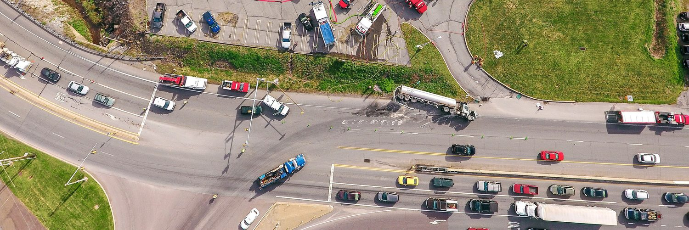

## PUBLIC USE

Gain enhanced situational awareness during time-critical missions. Make informed decisions while reducing exposure to risk.

UAS can provide real-time visual information to aid in assessing disaster areas, high-risk situations, or search and rescue missions. The same applies to a public utility that needs fast, actionable data to get the lights back on after a major storm. Public use includes researchers, universities, environmental groups, and state- or federally-funded organizations. Authorized governmental functions can also include Customs and Border Patrol (CBP), aeronautical research, or biological or geological resource management agencies.

- Maintain control of rapidly-changing events
- Provide real-time imagery to incident commanders
- Safely assess major disasters or high-risk areas
- Provide search and rescue support for missing persons
- Map crime scenes/accidents faster and more accurately
- Leverage multiple payloads:
- Thermal / Infrared
- Spotlights
- Chemical / Radiation detectors
- First aid kits / Life preservers

**Night Operations**

- Low light, infrared, thermal, LiDAR capabilities for night operations
- Night imagery and video for marketing, publicity
- Thermal Inspection
- Radiometric Mapping
- Search and Rescue
- Emergency Management
- Disaster Response
- Research & Development